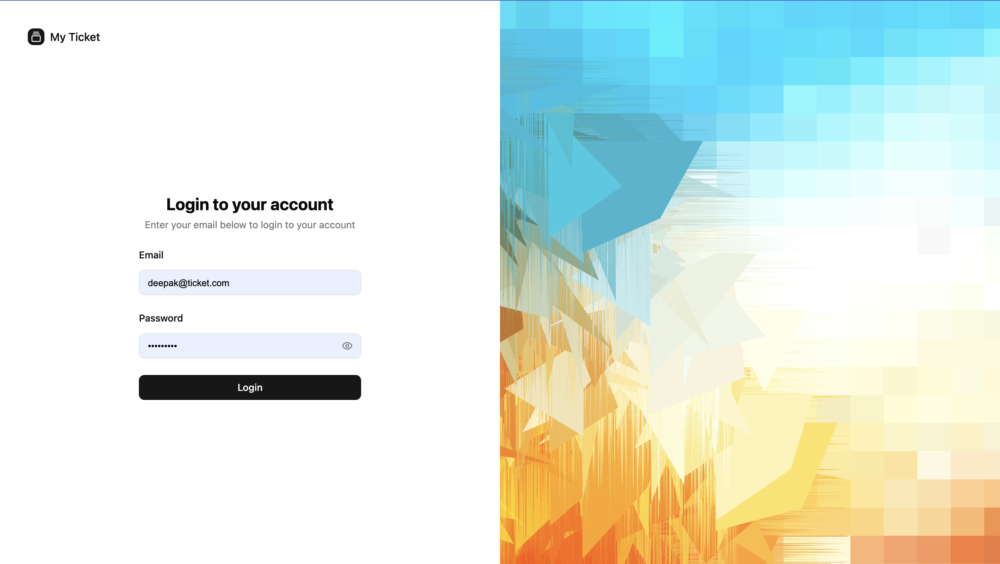
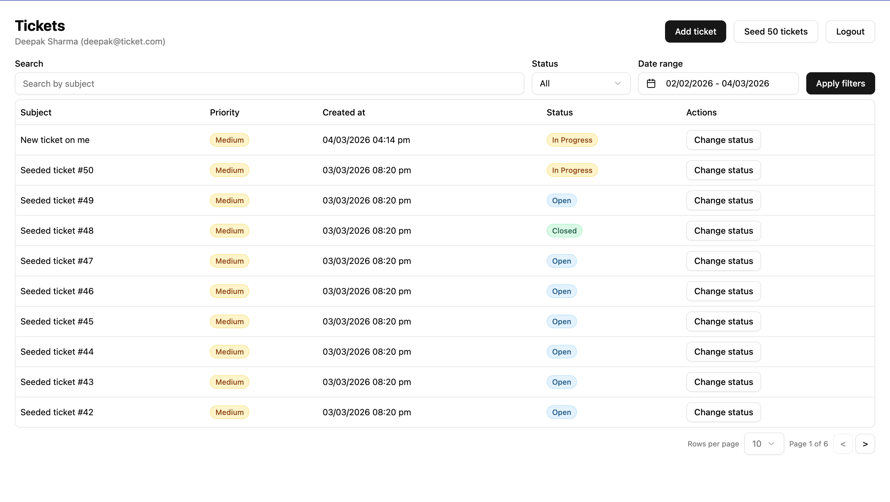
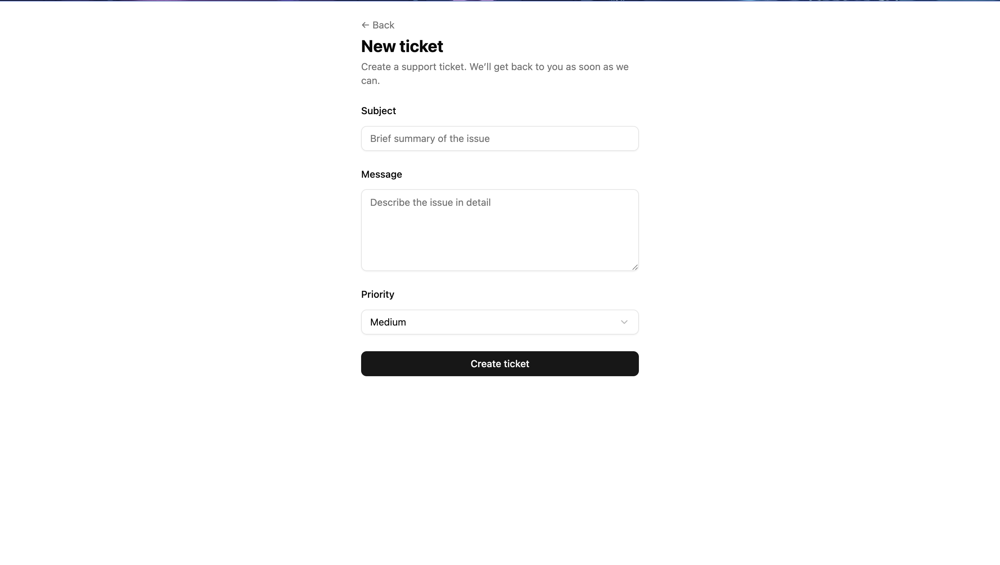

# Ticket Frontend

A modern React ticket management app with authentication, dashboard, and ticket creation. Built with Vite, TypeScript, React Router, Redux Toolkit, TanStack Query, and Tailwind CSS.

## Features

- **Authentication** — Login with email/password; protected routes
- **Dashboard** — View all tickets in a sortable, filterable table
- **Add Ticket** — Create support tickets with subject, message, and priority (Low / Medium / High)
- **Ticket listing** — Status badges, priority badges, and table actions

## Tech Stack

- **React 19** + **TypeScript**
- **Vite** — Build tooling
- **React Router v7** — Routing
- **Redux Toolkit** — Auth state
- **TanStack Query** — Server state & caching
- **React Hook Form** + **Zod** — Forms & validation
- **Tailwind CSS** — Styling
- **shadcn/ui** (Radix) — UI components
- **Axios** — API client

## Getting Started

### Prerequisites

- Node.js 18+
- npm or yarn

### Install & Run

```bash
npm install
npm run dev
```

Open [http://localhost:5173](http://localhost:5173). Use `/login` to sign in, then access the dashboard at `/` and create tickets at `/tickets/new`.

### Build

```bash
npm run build
npm run preview   # preview production build
```

### Scripts

| Script    | Description              |
| --------- | ------------------------ |
| `npm run dev`     | Start dev server        |
| `npm run build`   | TypeScript + Vite build |
| `npm run preview` | Preview production      |
| `npm run lint`    | Run ESLint              |

## Screenshots

### Login

Split-screen layout with email/password form and branding.



### Dashboard

Ticket list with header (user info, Add ticket, Seed 50 tickets, Logout) and data table.



### Add Ticket

Form to create a new ticket: subject, message, and priority.



## Project Structure

```
src/
├── components/     # Reusable UI (auth, badges, ui)
├── lib/            # API client, utils, errors
├── pages/          # Route pages (auth, tickets, Home)
├── router/         # App router & routes
├── store/          # Redux store & slices
├── schemas/        # Zod schemas
└── App.tsx, main.tsx
```
